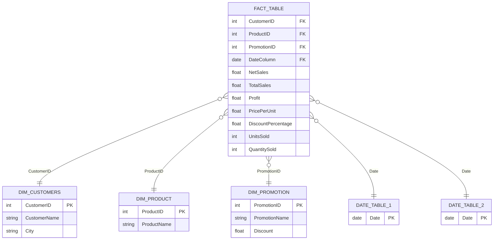

# 📊 Power BI Sales Analysis Dashboard

An end-to-end **Sales Performance Dashboard** built in Power BI, covering revenue, profit, unit sales, customer behavior, product performance, and promotional impact through a fully modeled star-schema data model and five interactive report pages.


---

## 🖼️ Dashboard Preview

> Add screenshots of each page here after exporting from Power BI Desktop (`File > Export > Export as image`), e.g.:
>
> ```md
> 
> 
> ```

---

## 📌 Project Overview

This project analyzes transactional sales data to answer key business questions such as:

- What are our total **Net Sales**, **Profit**, and **Units Sold**?
- How do **sales trends** move over time?
- Which **cities** generate the most revenue?
- Is there a relationship between **Profit** and **Net Sales**?
- Which **products** are the **top 5 vs. bottom 5** performers by sales, profit, and units sold?
- How do **promotions/discounts** affect sales performance?
- Who are our customers, and how can we drill into transaction-level detail?

The result is a 5-page interactive Power BI report backed by a clean, relational data model.

---

## 🗂️ Data Model (Star Schema)

The report is built on a classic **star schema** with one fact table and multiple dimension tables, plus a dedicated table for organizing DAX measures:



**Tables in the model:**

| Table | Purpose |
|---|---|
| `Fact table` | Core transactional grain — sales, profit, units, discounts, price per unit |
| `Dim Customers` | Customer names, IDs, and city (used for geographic + customer-level analysis) |
| `Dim Product` | Product ID → Product Name lookup |
| `Dim Promotion` | Promotion ID → Promotion Name + discount details |
| `date Table 1` / `date table 2` | Dedicated date dimensions supporting time-intelligence and role-playing date relationships |
| `measure table` | A disconnected "home" table used purely to organize standalone DAX measures (best-practice modeling pattern) |

Keeping measures in a separate `measure table` (rather than scattering them across fact/dimension tables) is a modeling best practice that keeps the **Fields** pane clean and easy to navigate.

---

## 📈 Report Pages

The report contains **5 pages**, each targeting a different analytical angle:

### 1️⃣ Overview
The executive summary page combining five visuals:
- **Card** — Count of Customers
- **Line Chart** — *Sales trends over period of time* (Net Sales by Date)
- **Map** — Net Sales by City (geographic distribution)
- **Scatter Chart** — *Profit vs Net Sales* (relationship/outlier analysis)
- **Bar Chart** — *Average Discount by Promotion Category*

### 2️⃣ Top-Bottom Analysis
A dedicated performance-ranking page with **6 bar charts** answering "who's winning and who's lagging":
- Top 5 & Bottom 5 products by **Sales**
- Top 5 & Bottom 5 products by **Units Sold**
- Top 5 & Bottom 5 products by **Profit**

### 3️⃣ Comparison — Sales / Profit / Quantity
Side-by-side clustered column charts comparing **Total Sales**, **Total Profit**, and **Units Sold**, filterable via **Date slicers** for period-over-period comparison.

### 4️⃣ Edit Interactions
A page purpose-built to demonstrate Power BI's **visual interaction editing**. It contains 6 bar charts (Net Sales / Units Sold / Profit) where specific cross-filtering behaviors have been intentionally customized — e.g., certain slicers/charts are configured to **not filter** other visuals on the page, giving fine-grained control over how the report responds to user clicks. This is a great showcase of going beyond default click-to-filter behavior.

### 5️⃣ Table Visual
A detailed, drillable transaction-level table (`Table visual`) exposing every key field — Customer ID, Date, Discount %, Net Sales, Price per Unit, Product ID, Profit, Promotion ID, Total Sales, and Units Sold — paired with **Customer**, **Product**, and **Date slicers** for granular, ad-hoc analysis.

---

## 🧮 Key Measures & Techniques Used

- **DAX Measures**: `Sum of Net Sales`, `Total Profit`, `Units Sold` aggregation, `Average Discount`
- **Date Hierarchies**: Year-level drill via the built-in Date Hierarchy on the Date column
- **Slicers**: Date, Customer Name, and Product Name slicers for interactive filtering
- **Custom Visual Interactions**: Manually configured `NoFilter` interactions between visuals
- **Star Schema Modeling**: Fact + Dimension design with a separate measures-only table
- **Geographic Visualization**: Map visual using City-level Net Sales

---

## 🛠️ Tech Stack

- **Power BI Desktop** (Fabric report format — built on the modern PBIR/TMDL-based `.pbix` structure)
- **DAX** for measures and calculations
- **Power Query / Data Model** for relationships between fact and dimension tables

---

## 📁 Repository Structure

```
📦 power-bi-sales-project
 ┣ 📜 POWER_BI_SALES_PROJECT.pbix   # Main Power BI file
 ┣ 📁 assets/                       # Screenshots (add your own exports here)
 ┗ 📜 README.md                     # You are here
```

---

## 🚀 How to Use

1. **Download** `POWER_BI_SALES_PROJECT.pbix` from this repository.
2. Open it in **Power BI Desktop** (free download from Microsoft).
3. Explore the 5 report pages using the page tabs at the bottom.
4. Use the **slicers** (Date, Customer, Product) to filter the data interactively.
5. Optionally, connect it to your own dataset by updating the data source in **Transform Data**.

---

## 🔮 Future Improvements

- [ ] Add Row-Level Security (RLS) for multi-region sales teams
- [ ] Publish to Power BI Service and embed a live report link/GIF here
- [ ] Add YoY / MoM growth measures using time-intelligence DAX functions
- [ ] Add a dedicated "Promotions ROI" page

---

## 👤 Author

**[Rohan Srivastav]**
📧 srivastavrohan54321@gmail.com.com · 🔗 [LinkedIn](https://www.linkedin.com/in/rohan-srivastav-1a623b1bb/) · 🌐 [Portfolio]()

---

⭐ If you found this project useful, consider giving it a star!
